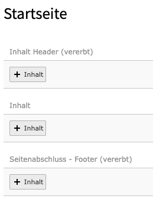
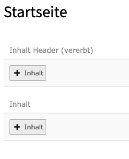

# Backend Layouts

Es wird 1 Backend-Layout in 2 Varianten mitgeliefert.

**Simple** Layout
* Variante mit statischem Footer
* Variante mit manuellem Footer

Die Varianten mit **manuellem Footer** bezeichnen ein Layout, in dem der Redakteur im Backend den Footer pro Seite selbst
gestalten kann und dieser auf die Unterseiten vererbt wird.

Die Varianten mit **statischem Footer** bezeichnen ein Layout, in dem der Redakteur keine Möglichkeit hat den Footer zu
beeinflussen bzw. diesen pro Seiten individuell anzupassen.


## Aktivieren der Backend-Layouts

Die Backend-Layouts werden in den Seiteneigenschaften im Reiter "Ressources" aktiviert. Je nachdem auf welcher Seite
man die Aktivierung vornimmt, werden die Layout auf die Unterseiten vererbt.

**Vorteil:**
Durch die Aktivierung des gewünschten Layouts ist es möglich im Projekt nur bestimmte Layouts zu zulassen bzw. es ist
möglich die Verwendung bestimmter Layouts nur auf ausgewählen Seiten zu gestatten. Dies bedeutet, werden _alle_ Layouts
auf der Root-Seite zugelassen, stehen diese auch auf allen Unterseiten zur Verfügung und können vom Redakteur benutzt
werden.


## Simple Layout

::: { .success }
Die Eingabe in _Inhalt Header (vererbt)_ ist per Default auf maximal 1 Element beschränkt!
:::

### Manueller Footer



### Statischer Footer



## Inhaltselemente einschränken

Mit der Nutzung der EXT:starter wird die Extension [content_defender](https://extensions.typo3.org/extension/content_defender/)
automatisch installiert. Durch diese Extension ist es möglich, die Inhaltselemente in den Backend Layouts zu definieren,
aber eine maximale Anzahl an Elemente zu verlangen.

### Beispiel - Header einschränken

In diesem Beispiel wird in dem Backend-Layout _Simple mit statischem Footer_ die Eingabe der Inhaltselemente
_Text_ und _Überschrift_ verboten.

```
mod.web_layout.BackendLayouts {
  SimpleWithoutFooter {
    config {
      backend_layout.rows.1.columns {
        1 {
          disallowed {
            CType = text,header
          }
        }
      }
    }
  }
}
```

### Weiterführende Beispiele

In der [Dokumentation des Content Defender](https://docs.typo3.org/typo3cms/extensions/content_defender/stable/) werden
weiter Beispiele beschrieben, wie man die maximale Anzahl an Elemente definieren kann, aber auch wie man nur bestimmte
Inhatlselemente zulässt.
